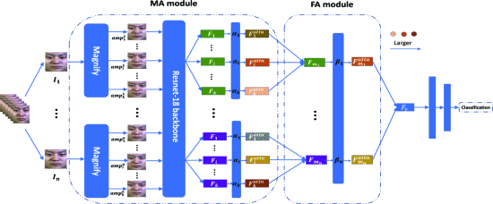
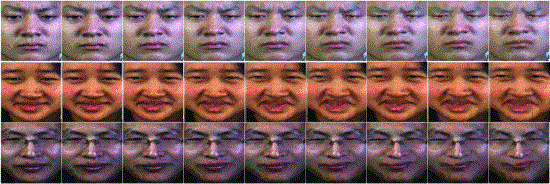

# A Novel Micro-Expression Recognition Approach Using Attention-Based Magnification-Adaptive Networks

**Mengting Wei, Wenming Zheng, Yuan Zong, Xingxun Jiang, Cheng Lu, Jiateng Liu**

In ICASSP 2022 (Download the paper [[here](https://ieeexplore.ieee.org/document/9747232)])

### Directory Structure

```text
project
├── README.md
├── dataset
│   └── load_dataset.py - script to load the dataset for training
├── extract_features
│   ├── resnet.py - script of the Resnet-18 model
│   └── resnet_features.py - script of extracting ME features
├── main
│   ├── config.py - check & change configurations here
│   ├── network.py - AMAN model
│   └── train.py - main script for training and testing
├── utils
│   └── util.py - script of some utils
|   |
```

### Dependices

Current version is tested on:

* Windows 10 Pro, 64 bit with  CUDA 11.4
* python==3.7.5
* torch==1.10.2
* torchvision==0.11.3
* numpy==1.21.6

### Model



### Dataset Preparation

- We use CASME II, SAMM and SMIC-HS for training.
  - Magnify the original frames according to the paper, you can use any techniques such as Eulerian Video Magnification, Lagrangian motion magnification or [Learning-based Magnification](https://openaccess.thecvf.com/content_ECCV_2018/papers/Tae-Hyun_Oh_Learning-based_Video_Motion_ECCV_2018_paper.pdf). We recommend you to use the last one since it can produce less artifacts.
- To reduce computational cost, extract the features with some former layers of the Resnet-18 and use the features for training and testing. The model is pre-trained on FER+.
- Demo of magnified images:



### Citation

If you find this code useful for your research, please consider citing the following paper:

```latex
@inproceedings{wei2022novel,
  title={A Novel Micro-Expression Recognition Approach Using Attention-Based Magnification-Adaptive Networks},
  author={Wei, Mengting and Zheng, Wenming and Zong, Yuan and Jiang, Xingxun and Lu, Cheng and Liu, Jiateng},
  booktitle={ICASSP 2022-2022 IEEE International Conference on Acoustics, Speech and Signal Processing (ICASSP)},
  pages={2420--2424},
  year={2022},
  organization={IEEE}
}
```

If you have any confusions about the code feel free to contact weimengting@seu.edu.cn.